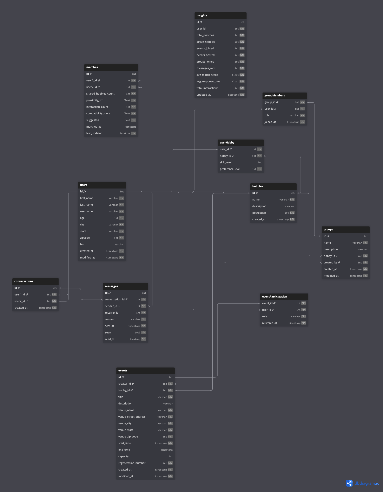
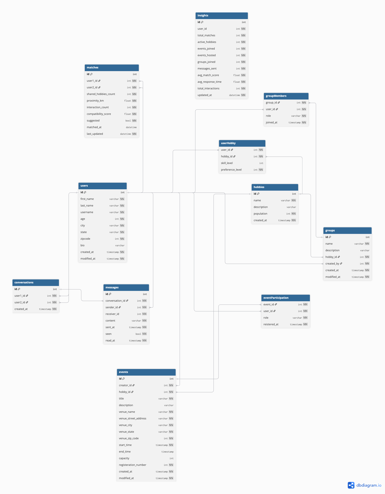

# Entity Relationship Diagram

Project: RendezVue 

**Disclaimer:**
    The structure of these tables may be adjusted later during the development process.

## List of Tables

- Users

| Column Name | Type | Nullable| Description | 
|-------------|------|---------|--------------|
| id | serial | false| primary key |
| first_name | varchar | false | first name of the user|
| last_name | varchar | false | last name of the user|
| username | varchar | false | username of the user|
| age| integer | false | age of the user|
| city| varchar | false | city where the user is living in |
| state| varchar | false | state where the user is living in |
| zipcode | integer | false | zipcode |
| bio | varchar | true | user description |
| created_at | datetime | false| timestamp when the user is created|
| modified_at | datetime | false| timestamp when the user is modified|

- Hobbies

| Column Name | Type | Nullable| Description | 
|-------------|------|---------|--------------|
| id | serial | false| primary key |
| name | varchar | false | hobby name|
| description| varchar | true | hobby description |
| population | int | false | number of people share the same hobby |
| created_at | datetime | false| timestamp when the user is created|

- User-Hobby:

Users - Hobbies: Many-to-many

| Column Name | Type | Nullable| Description | 
|-------------|------|---------|--------------|
| user_id | integer | false| foreign key Users.id|
| hobby_id | integer | false | foreign key Hobbies.id|
| skill_level | integer | true |  1 - 5 1: novice & 5: professional|
| preference_level | integer | false | 1 - 5 |

- Events

| Column Name | Type | Nullable| Description | 
|-------------|------|---------|--------------|
| id | serial | false| primary key |
| creator_id | integer | false | foreign key Users.id|
| hobby_id| integer | false | foreign key Hobbies.id |
| title| varchar | false | name of event |
| description |	varchar | true | description of event|	
| venue_name| varchar| false| name of the venue |
| venue_street_address| varchar| false| street address of the venue |
| venue_city| varchar| false| city of the venue |
| venue_state| varchar| false| state of the venue |
| venue_zip_code| integer| false| zipcode of the venue |
| start_time | datetime | false | start time|	
| end_time |	datetime | true | end time|	
| capacity |	integer | true | capacity |
| registeration_number |	integer | false | number of people attending the event |
| created_at |	datetime | false | timestamp when the event is created|
| modified_at |	datetime | false | timestamp when the event is modified|

- Event-Participation

Events - Users: Many-to-many

| Column Name | Type | Nullable| Description | 
|-------------|------|---------|--------------|
| event_id | integer | false| foreign key Events.id|
| user_id | integer | false | foreign key Users.id|
| role| varchar | false | Host/Participant |
| registered_at |	datetime | false | timestamp when the user registers for the event|	

- Groups

| Column Name | Type | Nullable| Description | 
|-------------|------|---------|--------------|
| id | serial | false| primary key|
| name | integer | false | name of the group|
| description| varchar | true | description of the group |
| hobby_id| integer | false | foreign key Hobbies.id |
| created_by |	integer | false | foreign key Users.id|	
| created_at |	timestamp | false | timestamp when the group was created|	
| modified_at | timestamp | false | timestamp when the group was modified |

- Group-Member

Groups - Users: Many-to-many

| Column Name | Type | Nullable| Description | 
|-------------|------|---------|--------------|
| group_id | integer | false| foreign key Groups.id|
| user_id | integer | false | foreign key Users.id|
| role| varchar | false | role of the user in the group |
| joined_at | timestamp | false | timestamp when the user joined the group|	

- Conversations

Conversations - Users: Many-to-one 

| Column Name | Type | Nullable| Description | 
|-------------|------|---------|--------------|
| id | serial | false| primary key|
| user1_id | integer | false | foreign key Users.id|
| user2_id | integer | false | foreign key Users.id|
| created_at | datetime | false | timestamp when the conversation was created|

- Messages 

Messages - Users: Many-to-one

| Column Name | Type | Nullable| Description | 
|-------------|------|---------|--------------|
| id | serial | false| primary key|
| conversation_id | integer | false| foreign key Conversation.id|
| sender_id | integer | false | foreign key Users.id|
| receiver_id | integer | false | foreign key Users.id|
| content | text| false | content of the message|
| sent_at | datetime | false | timestamp when the message was sent|
| seen | bool | false | True - receiver  False - receive not read|	
| read_at | datetime | false | timestamp when the message was read|	

- Matches

Matches - Users: Many-to-one

| Column Name | Type | Nullable| Description | 
|-------------|------|---------|--------------|
| id | serial | false| primary key|
| user1_id | integer | false | foreign key Users.id|
| user2_id | integer | false | foreign key Users.id|
| shared_hobbies_count | integer | false | count for shared hobbies|
| proximity_km | float | false | distance apart|
| interaction_count | integer | false | number of messages + events shared|
| compatibility_score | float | false | calculated based on shared hobbies, distance,...|	
| suggested | bool | false | whether the user should be suggested for other|	
| matched_at | datetime | true |timestamp when two users matched each other|	
| last_updated | datetime | false |timestamp when this match was updated|	

- Insights

Insights - Users: Many-to-one

| Column Name | Type | Nullable| Description | 
|-------------|------|---------|--------------|
| id | serial | false | primary key|
| user_id |	integer | false | foreign key Users.id |
| total_matches | integer | false |	total number of successful matches |
| active_hobbies | integer | false | count of hobbies user currently participates in|
| events_joined | integer | false |	how many events user has joined |
| events_hosted	| integer | false | how many events user has created |
| groups_joined	| integer | false |	number of hobby groups user is in |
| messages_sent	| integer | false |	total messages sent (to measure engagement) |
| avg_match_score |	float | false |	average compatibility score with other users |
| avg_response_time | float	| false | average response time to messages|
| total_interactions | integer | false | sum of messages, events, group activities |
| updated_at | datetime | false | timestamp when insights were last updated|

## Entity Relationship Diagram






## dbdiagram code

```
Table users {
  id int [primary key]
  first_name varchar [not null]
  last_name varchar [not null]
  username varchar [not null]
  age int [not null]
  city varchar [not null]
  state varchar [not null]
  zipcode int [not null]
  bio varchar
  created_at timestamp [not null]
  modified_at timestamp [not null]
}

Table hobbies {
  id int [primary key]
  name varchar [not null]
  description varchar 
  population int [not null]
  created_at timestamp [not null]
}

Table userHobby {
  user_id int [not null]
  hobby_id int [not null]
  skill_level int 
  preference_level int [not null]
}

Table events {
  id int [primary key]
  creator_id int [not null]
  hobby_id int [not null]
  title varchar [not null] 
  description varchar
  venue_name varchar [not null]
  venue_street_address varchar [not null]
  venue_city varchar [not null]
  venue_state varchar [not null]
  venue_zip_code int [not null]
  start_time timestamp [not null]
  end_time timestamp 
  capacity int 
  registeration_number int [not null]
  created_at timestamp [not null]
  modified_at timestamp [not null]
}

Table eventParticipation {
  event_id int [not null]
  user_id int [not null]
  role varchar [not null]
  reistered_at timestamp [not null]
} 

Table groups {
  id int [primary key]
  name varchar [not null]
  description varchar 
  hobby_id int [not null]
  created_by int [not null]
  created_at timestamp [not null]
  modified_at timestamp [not null]
}

Table groupMembers {
  group_id int [not null]
  user_id int [not null]
  role varchar [not null]
  joined_at timestamp [not null]
} 

Table conversations {
  id int [primary key]
  user1_id int [not null]
  user2_id int [not null]
  created_at timestamp [not null]
}

Table messages {
  id int [primary key]
  conversation_id int [not null]
  sender_id int [not null]
  receiver_id int [not null]
  content varchar [not null]
  sent_at  timestamp [not null]
  seen bool [not null]
  read_at  timestamp [not null]
}

Table matches {
  id  int [primary key]
  user1_id  int  [not null]
  user2_id  int  [not null]
  shared_hobbies_count  int  [not null]
  proximity_km  float  [not null]
  interaction_count  int  [not null]
  compatibility_score  float  [not null]
  suggested  bool [not null]
  matched_at  datetime 
  last_updated  datetime [not null]
}

Table insights {
  id int [primary key]
  user_id int [not null]
  total_matches int [not null]
  active_hobbies int [not null]
  events_joined int [not null]
  events_hosted	int [not null]
  groups_joined int [not null]
  messages_sent	int [not null]
  avg_match_score float [not null]
  avg_response_time float [not null]
  total_interactions int [not null]
  updated_at datetime [not null]
}

Ref: userHobby.user_id > users.id // many-to-one

Ref: userHobby.hobby_id > hobbies.id // many-to-one

Ref: events.creator_id > users.id // many-to-one

Ref: events.hobby_id > hobbies.id // many-to-one

Ref: eventParticipation.user_id > users.id // many-to-one

Ref: eventParticipation.event_id > events.id // many-to-one

Ref: groups.created_by > users.id // many-to-one

Ref: groups.hobby_id > hobbies.id // many-to-one

Ref: groupMembers.group_id > groups.id //many-to-one

Ref: groupMembers.user_id > users.id // many-to-one

Ref: matches.user1_id > users.id // many-to-one

Ref: matches.user2_id > users.id // many-to-one

Ref: conversations.user1_id > users.id // many-to-one

Ref: conversations.user2_id > users.id // many-to-one

Ref: messages.sender_id > users.id // many-to-one

Ref: messages.conversation_id > conversations.id // many-to-one
```